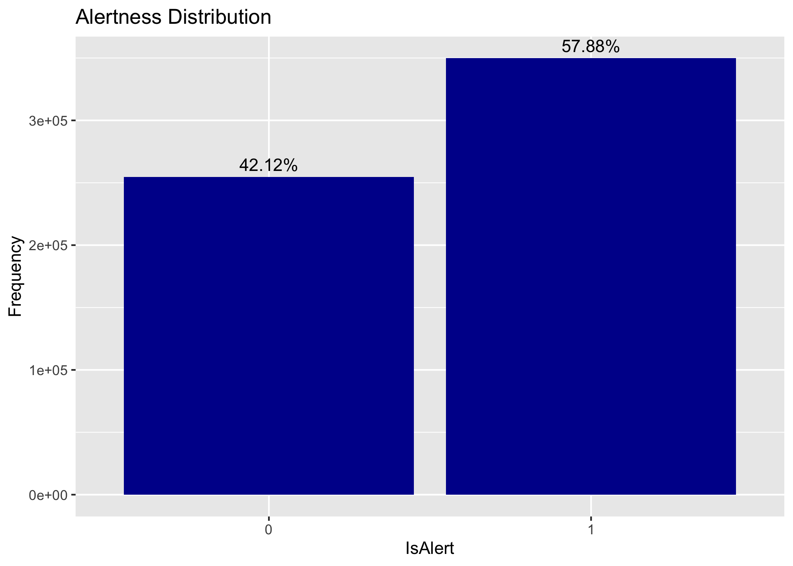
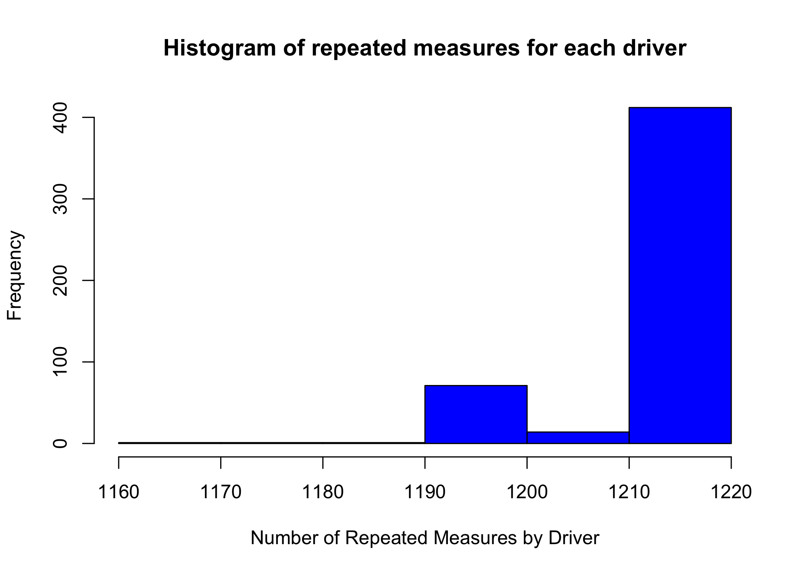
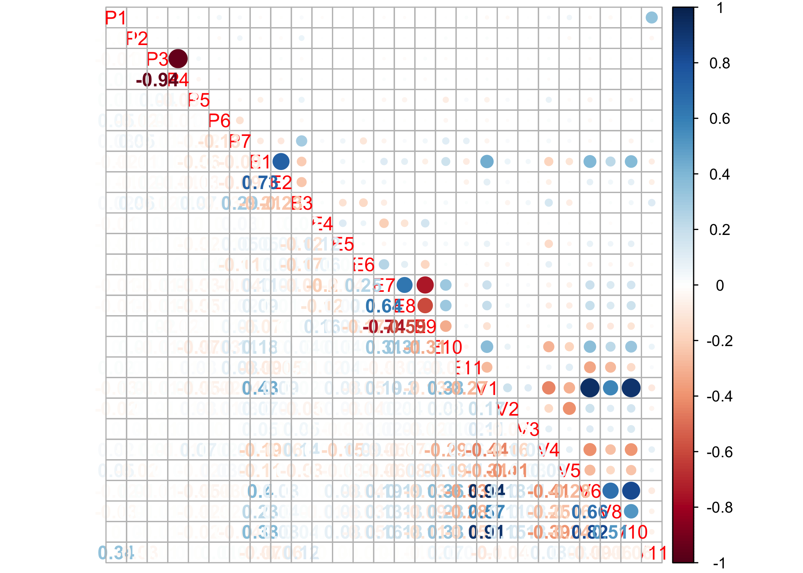

Driver Alertness Analysis
================

# Preliminary Data Analysis

## Source

The dataset is publically available on kaggle’s website as a part of
competition held five years ago on 19th Jan, 2011 under the name of
“Stay Alert\! The Ford Challenge”.

``` r
##### Reading the files for analysis #####
# Train Data would be used for training the model and testing the model performance
data <- read.csv("Data/fordTrain.csv",
                 header=TRUE, stringsAsFactors=FALSE, na.strings = c("NA", ""),
                 strip.white = TRUE, blank.lines.skip=TRUE, skip=0)

# Test Data would be used as a holdout set for model validation
validatedata <- read.csv("Data/fordTest.csv",
                         header=TRUE, stringsAsFactors=FALSE, na.strings = c("NA", ""),
                         strip.white = TRUE, blank.lines.skip=TRUE, skip=0)

dim(data)
```

    ## [1] 604329     33

## Data Description

The dataset of 604329 observations consists of 100 drivers of both
genders, of different ages and ethnic backgrounds, who have been sampled
a total of 500 times against 3 key sets of variables. There are 33
attributes in the dataset in total.

  - Physiological (8 features) defined simply as P1 to P8.
  - Environmental (11 features) defined simply as E1 to E11.
  - Vehicular (11 features) defined simply as V1 to V11.

Each driver trail has been recorded in a simulated driving environment
for a period of 2 minutes and an observation recorded every 100
milliseconds. Each driver’s trail has been defined uniquely and labelled
at TrialID and every observation within each trail is defined uniquely
and labelled as ObsNum.

The objective is to design a classifier that will detect whether the
driver is alert or not alert using predictors like the driver’s
physiological attributes combined with vehicular and environmental
attributes acquired from the simulated environment. The outcome variable
is also provide in the dataset and is labelled as IsAlert and is a
binary (0 or 1) outcome where ‘1’ means alert and ‘0’ means not alert.

``` r
##### Printing the distribution of Result #####
counts <- table(data$IsAlert)
countsframe<-as.data.frame(counts)

ggplot(countsframe, aes(x = Var1, y = Freq)) +
  geom_bar(stat = "identity", fill = '#000099') +
  geom_text(aes(label = sprintf("%.2f%%", Freq/sum(Freq) * 100))  , 
            vjust = -.5)+
  scale_size_area() +
  ggtitle("Alertness Distribution") + xlab("IsAlert") + ylab("Frequency")
```

<!-- -->

From the above plot, it is noted that 42.12% of the observations are not
alert, which means the dataset is fairly balanced for modelling assuming
we don’t drop any observation in data pre-processing.

## Descriptive statistics and analysis

**Dataset Assumption**: It is assumed that the dataset is collected in
same simulated environment using the same sensors for all trials of
different drivers.

**Descriptive statistics**:

``` r
#Descriptive Statistics
psych::describe(data, fast = FALSE )
```

    ##         vars      n    mean      sd  median trimmed    mad     min
    ## TrialID    1 604329  250.17  145.45  250.00  249.49 185.32    0.00
    ## ObsNum     2 604329  603.84  348.93  604.00  603.83 447.75    0.00
    ## IsAlert    3 604329    0.58    0.49    1.00    0.60   0.00    0.00
    ## P1         4 604329   35.45    7.48   34.15   34.56   4.00  -22.48
    ## P2         5 604329   12.00    3.76   11.40   11.74   2.62  -45.63
    ## P3         6 604329 1026.67  309.28 1000.00 1008.35 320.24  504.00
    ## P4         7 604329   64.06   19.76   60.00   62.45  20.53   23.89
    ## P5         8 604329    0.18    0.37    0.11    0.13   0.03    0.04
    ## P6         9 604329  845.38 2505.34  800.00  794.79 177.91  128.00
    ## P7        10 604329   77.89   18.58   75.00   77.20  17.35    0.26
    ## P8        11 604329    0.00    0.00    0.00    0.00   0.00    0.00
    ## E1        12 604329   10.51   14.05    0.00    9.06   0.00    0.00
    ## E2        13 604329  102.79  127.26    0.00   85.89   0.00    0.00
    ## E3        14 604329    0.29    1.01    0.00    0.00   0.00    0.00
    ## E4        15 604329   -4.23   35.51    0.00   -1.26  11.86 -250.00
    ## E5        16 604329    0.02    0.00    0.02    0.02   0.00    0.01
    ## E6        17 604329  358.67   27.40  365.00  360.09  19.27  260.00
    ## E7        18 604329    1.76    2.85    1.00    1.02   1.48    0.00
    ## E8        19 604329    1.38    1.61    1.00    1.10   1.48    0.00
    ## E9        20 604329    0.88    0.33    1.00    0.97   0.00    0.00
    ## E10       21 604329   63.31   18.89   67.00   63.49  11.86    0.00
    ## E11       22 604329    1.32    5.25    0.00    0.00   0.00    0.00
    ## V1        23 604329   76.97   44.39  100.40   81.48  17.11    0.00
    ## V2        24 604329   -0.04    0.40    0.00   -0.03   0.26   -4.80
    ## V3        25 604329  573.79  298.41  511.00  559.53 379.55  240.00
    ## V4        26 604329   19.96   63.27    3.02    5.23   2.27    0.00
    ## V5        27 604329    0.18    0.38    0.00    0.10   0.00    0.00
    ## V6        28 604329 1715.69  618.18 1994.00 1769.39 302.45    0.00
    ## V7        29 604329    0.00    0.00    0.00    0.00   0.00    0.00
    ## V8        30 604329   12.71   11.53   12.80   11.78  18.09    0.00
    ## V9        31 604329    0.00    0.00    0.00    0.00   0.00    0.00
    ## V10       32 604329    3.31    1.24    4.00    3.50   0.00    1.00
    ## V11       33 604329   11.67    9.93   10.77   11.35   4.94    1.68
    ##               max     range  skew kurtosis   se
    ## TrialID    510.00    510.00  0.02    -1.17 0.19
    ## ObsNum    1210.00   1210.00  0.00    -1.20 0.45
    ## IsAlert      1.00      1.00 -0.32    -1.90 0.00
    ## P1         101.35    123.83  2.45    17.77 0.01
    ## P2          71.17    116.80  0.86    10.06 0.00
    ## P3        2512.00   2008.00  0.51    -0.28 0.40
    ## P4         119.05     95.16  0.64    -0.30 0.03
    ## P5          27.20     27.16 20.22   937.06 0.00
    ## P6      228812.00 228684.00 89.79  8164.54 3.22
    ## P7         468.75    468.49  1.94    22.75 0.02
    ## P8           0.00      0.00   NaN      NaN 0.00
    ## E1         243.99    243.99  0.77     0.15 0.02
    ## E2         360.00    360.00  0.75    -1.00 0.16
    ## E3           4.00      4.00  3.35     9.42 0.00
    ## E4         260.00    510.00 -2.47    19.76 0.05
    ## E5           0.02      0.02  0.18     3.82 0.00
    ## E6         513.00    253.00 -0.47     2.95 0.04
    ## E7          25.00     25.00  2.84     8.13 0.00
    ## E8           9.00      9.00  2.20     6.34 0.00
    ## E9           1.00      1.00 -2.29     3.26 0.00
    ## E10        127.00    127.00 -0.43     1.11 0.02
    ## E11         52.40     52.40  4.06    15.66 0.01
    ## V1         129.70    129.70 -0.94    -0.85 0.06
    ## V2           3.99      8.79 -0.76    14.69 0.00
    ## V3        1023.00    783.00  0.26    -1.42 0.38
    ## V4         484.49    484.49  5.14    27.41 0.08
    ## V5           1.00      1.00  1.67     0.78 0.00
    ## V6        4892.00   4892.00 -0.87    -0.79 0.80
    ## V7           0.00      0.00   NaN      NaN 0.00
    ## V8          82.10     82.10  0.41    -0.70 0.01
    ## V9           0.00      0.00   NaN      NaN 0.00
    ## V10          7.00      6.00 -1.17    -0.16 0.00
    ## V11        262.53    260.86 21.17   527.15 0.01

The primary issue at play is the lack of data dictionary. The various
predictor variables are merely categorised in to three types of
attributes as Physiological, Environmental and Vehicular and simply
labelled as P1-P8, E1-E11 and V1-V11. The descriptive stats show that

  - All the variables/attributes are numerical as categorical variables
    are usually listed with an asterisk in the descriptive summary.
    However looking at low range of some of the variables like E3, E8,
    E9, V5, V10 it can be assumed that the variables may be categorical.
  - One particular variable (P6) is highly skewed having a max value of
    228812 and a mean if just 845.38 which suggest some extreme
    outliers. We will have look at outliers in the outliers’ analysis
    section.
  - Variable P8, V7 and V9 are all zeroes irrespective of the response
    variable being 0 or 1. These three variables will be dropped from
    the dataset for modelling purpose.
  - Looking at the skewness, many of the variables are not ‘normal’ in
    their distribution. This affects the choice of models that be
    applied to the dataset.

The response variable IsAlert is definitely a categorical variable with
possible values of 1 (Alert) and 0 (Not Alert). For modelling purpose,
we will convert the response variable in to a factor variable.

**Missing Value Analysis**:

``` r
#No missing values
summary(data)
```

    ##     TrialID          ObsNum          IsAlert             P1        
    ##  Min.   :  0.0   Min.   :   0.0   Min.   :0.0000   Min.   :-22.48  
    ##  1st Qu.:125.0   1st Qu.: 302.0   1st Qu.:0.0000   1st Qu.: 31.76  
    ##  Median :250.0   Median : 604.0   Median :1.0000   Median : 34.15  
    ##  Mean   :250.2   Mean   : 603.8   Mean   :0.5788   Mean   : 35.45  
    ##  3rd Qu.:374.0   3rd Qu.: 906.0   3rd Qu.:1.0000   3rd Qu.: 37.31  
    ##  Max.   :510.0   Max.   :1210.0   Max.   :1.0000   Max.   :101.35  
    ##        P2                P3             P4               P5          
    ##  Min.   :-45.629   Min.   : 504   Min.   : 23.89   Min.   : 0.03892  
    ##  1st Qu.:  9.904   1st Qu.: 792   1st Qu.: 49.18   1st Qu.: 0.09211  
    ##  Median : 11.400   Median :1000   Median : 60.00   Median : 0.10508  
    ##  Mean   : 11.997   Mean   :1027   Mean   : 64.06   Mean   : 0.17892  
    ##  3rd Qu.: 13.644   3rd Qu.:1220   3rd Qu.: 75.76   3rd Qu.: 0.13881  
    ##  Max.   : 71.174   Max.   :2512   Max.   :119.05   Max.   :27.20220  
    ##        P6                 P7                 P8          E1        
    ##  Min.   :   128.0   Min.   :  0.2622   Min.   :0   Min.   :  0.00  
    ##  1st Qu.:   668.0   1st Qu.: 66.6667   1st Qu.:0   1st Qu.:  0.00  
    ##  Median :   800.0   Median : 75.0000   Median :0   Median :  0.00  
    ##  Mean   :   845.4   Mean   : 77.8876   Mean   :0   Mean   : 10.51  
    ##  3rd Qu.:   900.0   3rd Qu.: 89.8204   3rd Qu.:0   3rd Qu.: 28.24  
    ##  Max.   :228812.0   Max.   :468.7500   Max.   :0   Max.   :243.99  
    ##        E2              E3               E4                E5         
    ##  Min.   :  0.0   Min.   :0.0000   Min.   :-250.00   Min.   :0.00800  
    ##  1st Qu.:  0.0   1st Qu.:0.0000   1st Qu.:  -8.00   1st Qu.:0.01569  
    ##  Median :  0.0   Median :0.0000   Median :   0.00   Median :0.01600  
    ##  Mean   :102.8   Mean   :0.2906   Mean   :  -4.23   Mean   :0.01626  
    ##  3rd Qu.:211.6   3rd Qu.:0.0000   3rd Qu.:   6.00   3rd Qu.:0.01669  
    ##  Max.   :360.0   Max.   :4.0000   Max.   : 260.00   Max.   :0.02394  
    ##        E6              E7               E8              E9        
    ##  Min.   :260.0   Min.   : 0.000   Min.   :0.000   Min.   :0.0000  
    ##  1st Qu.:348.0   1st Qu.: 0.000   1st Qu.:0.000   1st Qu.:1.0000  
    ##  Median :365.0   Median : 1.000   Median :1.000   Median :1.0000  
    ##  Mean   :358.7   Mean   : 1.757   Mean   :1.383   Mean   :0.8768  
    ##  3rd Qu.:367.0   3rd Qu.: 2.000   3rd Qu.:2.000   3rd Qu.:1.0000  
    ##  Max.   :513.0   Max.   :25.000   Max.   :9.000   Max.   :1.0000  
    ##       E10              E11               V1               V2          
    ##  Min.   :  0.00   Min.   : 0.000   Min.   :  0.00   Min.   :-4.79500  
    ##  1st Qu.: 52.00   1st Qu.: 0.000   1st Qu.: 41.93   1st Qu.:-0.17500  
    ##  Median : 67.00   Median : 0.000   Median :100.40   Median : 0.00000  
    ##  Mean   : 63.31   Mean   : 1.315   Mean   : 76.97   Mean   :-0.03771  
    ##  3rd Qu.: 73.00   3rd Qu.: 0.000   3rd Qu.:108.50   3rd Qu.: 0.07000  
    ##  Max.   :127.00   Max.   :52.400   Max.   :129.70   Max.   : 3.99000  
    ##        V3               V4                V5               V6      
    ##  Min.   : 240.0   Min.   :  0.000   Min.   :0.0000   Min.   :   0  
    ##  1st Qu.: 255.0   1st Qu.:  1.488   1st Qu.:0.0000   1st Qu.:1259  
    ##  Median : 511.0   Median :  3.019   Median :0.0000   Median :1994  
    ##  Mean   : 573.8   Mean   : 19.961   Mean   :0.1798   Mean   :1716  
    ##  3rd Qu.: 767.0   3rd Qu.:  7.481   3rd Qu.:0.0000   3rd Qu.:2146  
    ##  Max.   :1023.0   Max.   :484.488   Max.   :1.0000   Max.   :4892  
    ##        V7          V8              V9         V10             V11         
    ##  Min.   :0   Min.   : 0.00   Min.   :0   Min.   :1.000   Min.   :  1.677  
    ##  1st Qu.:0   1st Qu.: 0.00   1st Qu.:0   1st Qu.:3.000   1st Qu.:  7.948  
    ##  Median :0   Median :12.80   Median :0   Median :4.000   Median : 10.773  
    ##  Mean   :0   Mean   :12.71   Mean   :0   Mean   :3.312   Mean   : 11.668  
    ##  3rd Qu.:0   3rd Qu.:21.90   3rd Qu.:0   3rd Qu.:4.000   3rd Qu.: 15.271  
    ##  Max.   :0   Max.   :82.10   Max.   :0   Max.   :7.000   Max.   :262.534

Looking at the summary of the dataset, we can see that none of the
variables have missing values otherwise the variable would have been
summarized with a statistics of NA’s having a valid positive integer
values.

**Repeated Measure Analysis**:

``` r
########### Repeated Measure Analysis ################
hist_data <- data %>% count(TrialID)
hist(hist_data$n, main = "Histogram of repeated measures for each driver", 
     xlab="Number of Repeated Measures by Driver", ylab="Frequency", col = "blue"
     , breaks=seq(1160,1220,by=10))
```

<!-- -->

Not all of the 500 trails have 1211 observations each. This could be
indicative of inconsistent instrumentation for data acquisition. These
are assumed to be missing completely at random (unrelated to a predictor
or outcome variables) to satisfy modelling assumptions. Hence, we will
not remove the trails where the observations are less than 1211 as it
will be a significant loss of information.

**Outlier Analysis**: Box plots and histograms of individual attributes
can be found in the appendix.

All variables have some outliers. In some cases these are quite extreme.
We are unable to determine if these from data quality issues or true
values as we don’t have the data description of each of the attributes.

Looking at the box plot of P5, P6, E3, E7, E11 and V4 suggests that the
data consists mostly of zeroes. However we can’t simply exclude them
from analysis as outliers might be a key contributor in predicting the
outcome variable. It would be good to look at the distribution of
outcome variable for these attributes. For this we will split the
dataset based on outcome variable as alert and not alert dataset.
Looking at the overlaid histogram (included in the appendix) of the
above attributes, we can see that these variables are almost equally
distributed among the two subsets. Hence, we will include these
attributes in our analysis.

**Multicollinearity Analysis**: Physiological attributes 3&4 and
Vehicular attributes 1 is highly correlated with vehicular attribute 6
&10. Only 1 from each mentioned set of correlated attributes will likely
be used for this analysis. The plot below shows the collinearity among
various attributes. Usually a threshold of .75 for coefficient of
correlation is considered to be of high strength relationship.

``` r
############ Correlation Analysis #####################
cor_data_full <- data[,!(names(data) %in% c("IsAlert","TrialID","ObsNum","P8","V7","V9"))]

##### Computing the correlation matrix ######
cor_mat_full <- cor(cor_data_full, use="complete.obs")

##### Computing the correlation matrix ######
corrplot.mixed(cor_mat_full, lower="number", upper="circle")
```

<!-- -->

# Data Preparation

## Variable Importance

We have already dropped three variables namely P8, V7 and V9 because
they are all zeroes. We have already done the collinearity analysis to
find out the highly correlated variables, which will help us in
dimensionality reduction.

Another technique which we are going to use is Ensemble Feature
Selection using fscaret package in R to find out individual variable
importance. The fscaret package is closely related to caret package in R
and uses the underlying caret function to get its job done. The ensemble
feature selection takes in a data set and a list of models and, in
return, fscaret will scale and return the importance of each variable
for each model and for the ensemble of models. The tool extracts the
importance of each variable by using the selected models’ VarImp or
similar measuring function. For example, linear models use the absolute
value of the t-statistic for each parameter and decision-tree models,
total the importance of the individual trees, etc. It returns individual
and combined MSEs and RMSEs:

MSE (Mean Squared Error): the variance of the estimator  
RMSE (Root Mean Squared Error): the standard deviation of the sample

For this technique to work, the data needs to be formatted in multiple
in, single out (MISO) format. Also the output needs to be the last
column in the data frame. Since our outcome variable IsAlert is not the
last column, we will need to format the dataset.

``` r
#Formatting Dataset
data <- data[c(
  "TrialID", "ObsNum", "P1", "P2", "P3", "P4", "P5",
  "P6", "P7", "P8", "E1", "E2", "E3", "E4", "E5", "E6",
  "E7", "E8", "E9", "E10", "E11", "V1", "V2", "V3", "V4",
  "V5", "V6", "V7", "V8", "V9", "V10", "V11", "IsAlert"
)]
```

As mention in the descriptive analysis, some of the variables in the
dataset appear to be categorical in nature. We will convert those
variables to factor using a custom function.

``` r
# Convert any potential factors in the data through heuristic.
# If number of unique values in dataset is less than specified threshold
# then treat as categorical data
auto_convert_factors <- function(data, cat_threshold=10, cols_ignore=list()) {
  
  for (col in names(data)) {
    if (!is.factor(data[[col]]) && 
        length(unique(data[[col]])) <= cat_threshold && 
        !is.element(col, cols_ignore)) {
      data[[col]] <- as.factor(data[[col]])
      cat(col, " converted to factor\n")
    }
  }
  data
}

isAlertData <- auto_convert_factors(data, 10, cols_ignore = list('IsAlert'))
```

    ## P8  converted to factor
    ## E3  converted to factor
    ## E8  converted to factor
    ## E9  converted to factor
    ## V5  converted to factor
    ## V7  converted to factor
    ## V9  converted to factor
    ## V10  converted to factor

Next step is to dummify the factor variables. To do that, we will use
some of the caret
functions.

``` r
#Dropping P8, V7, V9 as they are all zeroes. Dropping TrailID and ObsNum as they are unique ids.
isAlertData<-isAlertData[c("P1", "P2", "P3", "P4", "P5", 
                           "P6", "P7", "E1", "E2", "E3", "E4", "E5", "E6", "E7", "E8", 
                           "E9", "E10", "E11", "V1", "V2", "V3", "V4","V5", "V6", "V8",
                           "V10", "V11", "IsAlert")]

datadummy<-dummyVars("~.",data=isAlertData,fullRank = F)
datatemp<-as.data.frame(predict(datadummy,isAlertData))
```

We now need a training and a test dataset, for which, again we will use
a **caret** function called *createDataPartition*.

``` r
#Partitioning dataset in to training and test dataset.
splitIndexMulti <- createDataPartition(datatemp$IsAlert, p=.01, list = FALSE, times = 2)

trainDataset <- datatemp[splitIndexMulti[,1],]
testDataset <- datatemp[splitIndexMulti[,2],]

dim(datatemp)
```

    ## [1] 604329     45

``` r
dim(trainDataset)
```

    ## [1] 6044   45

``` r
dim(testDataset)
```

    ## [1] 6044   45

Finally, we need to select an ensemble of models and feed the data and
list of models to the main function of the fscaret package named as its
package, fscaret. Since our problem is a classification problem, we can
choose either the models specific for classification or dual purpose
modes (classification and regression). We have chosen seven models here.

``` r
#Variable Importance
list_of_models <- c("glm", "gbm", "treebag", "ridge", "lasso", "rf", "xgbLinear")

feature_selection_models <- fscaret(trainDataset, testDataset,
                                    myTimeLimit = 40, preprocessData = TRUE,
                                    Used.funcRegPred = list_of_models, with.labels = TRUE,
                                    supress.output = TRUE, no.cores = 2, installReqPckg = TRUE
)
```

    ## Loading required package: R.utils

    ## Loading required package: R.oo

    ## Loading required package: R.methodsS3

    ## R.methodsS3 v1.7.1 (2016-02-15) successfully loaded. See ?R.methodsS3 for help.

    ## R.oo v1.23.0 successfully loaded. See ?R.oo for help.

    ## 
    ## Attaching package: 'R.oo'

    ## The following object is masked from 'package:R.methodsS3':
    ## 
    ##     throw

    ## The following objects are masked from 'package:methods':
    ## 
    ##     getClasses, getMethods

    ## The following objects are masked from 'package:base':
    ## 
    ##     attach, detach, load, save

    ## R.utils v2.9.0 successfully loaded. See ?R.utils for help.

    ## 
    ## Attaching package: 'R.utils'

    ## The following object is masked from 'package:utils':
    ## 
    ##     timestamp

    ## The following objects are masked from 'package:base':
    ## 
    ##     cat, commandArgs, getOption, inherits, isOpen, parse, warnings

    ## Installing package into '/Users/anuj/git/packtest/packrat/lib/x86_64-apple-darwin18.2.0/3.5.3'
    ## (as 'lib' is unspecified)

    ## Loading required package: MASS

    ## 
    ## Attaching package: 'MASS'

    ## The following object is masked from 'package:dplyr':
    ## 
    ##     select

    ## Loading required package: multicore

The output of the fscaret function (feature\_selection\_models) holds a
lot of information. One of the most interesting result set is the
VarImp$matrixVarImp.MSE (Mean Squared Error). This returns the top
variables from the perspective of all models involved (the MSE is scaled
to compare each model equally):

``` r
names(feature_selection_models)
```

    ## [1] "ModelPred" "VarImp"    "PPlabels"  "PPTrainDF" "PPTestDF"

``` r
feature_selection_models$VarImp
```

    ## $rawMSE
    ##         glm
    ## 1 0.1506021
    ## 
    ## $rawRMSE
    ##         glm
    ## 1 0.3880749
    ## 
    ## $matrixVarImp.RMSE
    ##            glm         SUM        SUM%    ImpGrad Input_no
    ## 19 12.62254468 12.62254468 100.0000000  0.0000000       19
    ## 27 10.34976348 10.34976348  81.9942709 18.0057291       27
    ## 6   8.86616603  8.86616603  70.2407182 14.3346024        6
    ## 28  7.84327812  7.84327812  62.1370597 11.5369812       28
    ## 20  7.82705883  7.82705883  62.0085651  0.2067922       20
    ## 16  7.78705911  7.78705911  61.6916740  0.5110441       16
    ## 13  7.53534839  7.53534839  59.6975379  3.2324234       13
    ## 25  5.02135928  5.02135928  39.7808794 33.3626128       25
    ## 9   4.13925861  4.13925861  32.7925844 17.5669698        9
    ## 14  3.48672654  3.48672654  27.6230081 15.7644673       14
    ## 4   2.89550850  2.89550850  22.9391820 16.9562493        4
    ## 12  2.64208380  2.64208380  20.9314672  8.7523381       12
    ## 23  2.38132517  2.38132517  18.8656505  9.8694309       23
    ## 1   2.33363691  2.33363691  18.4878483  2.0025931        1
    ## 22  2.23594661  2.23594661  17.7139133  4.1861825       22
    ## 18  2.17019226  2.17019226  17.1929854  2.9407835       18
    ## 17  2.01521329  2.01521329  15.9651904  7.1412553       17
    ## 5   1.58695693  1.58695693  12.5724010 21.2511679        5
    ## 15  1.52927978  1.52927978  12.1154634  3.6344496       15
    ## 26  0.98067892  0.98067892   7.7692648 35.8731519       26
    ## 7   0.86395986  0.86395986   6.8445775 11.9018634        7
    ## 24  0.85126433  0.85126433   6.7439994  1.4694576       24
    ## 21  0.69322882  0.69322882   5.4919894 18.5647992       21
    ## 11  0.64108347  0.64108347   5.0788766  7.5220975       11
    ## 3   0.38152478  0.38152478   3.0225663 40.4875040        3
    ## 10  0.15679230  0.15679230   1.2421608 58.9037706       10
    ## 2   0.10085074  0.10085074   0.7989731 35.6787645        2
    ## 8   0.06191043  0.06191043   0.4904751 38.6118227        8
    ## 
    ## $matrixVarImp.MSE
    ##            glm         SUM        SUM%    ImpGrad Input_no
    ## 19 12.62254468 12.62254468 100.0000000  0.0000000       19
    ## 27 10.34976348 10.34976348  81.9942709 18.0057291       27
    ## 6   8.86616603  8.86616603  70.2407182 14.3346024        6
    ## 28  7.84327812  7.84327812  62.1370597 11.5369812       28
    ## 20  7.82705883  7.82705883  62.0085651  0.2067922       20
    ## 16  7.78705911  7.78705911  61.6916740  0.5110441       16
    ## 13  7.53534839  7.53534839  59.6975379  3.2324234       13
    ## 25  5.02135928  5.02135928  39.7808794 33.3626128       25
    ## 9   4.13925861  4.13925861  32.7925844 17.5669698        9
    ## 14  3.48672654  3.48672654  27.6230081 15.7644673       14
    ## 4   2.89550850  2.89550850  22.9391820 16.9562493        4
    ## 12  2.64208380  2.64208380  20.9314672  8.7523381       12
    ## 23  2.38132517  2.38132517  18.8656505  9.8694309       23
    ## 1   2.33363691  2.33363691  18.4878483  2.0025931        1
    ## 22  2.23594661  2.23594661  17.7139133  4.1861825       22
    ## 18  2.17019226  2.17019226  17.1929854  2.9407835       18
    ## 17  2.01521329  2.01521329  15.9651904  7.1412553       17
    ## 5   1.58695693  1.58695693  12.5724010 21.2511679        5
    ## 15  1.52927978  1.52927978  12.1154634  3.6344496       15
    ## 26  0.98067892  0.98067892   7.7692648 35.8731519       26
    ## 7   0.86395986  0.86395986   6.8445775 11.9018634        7
    ## 24  0.85126433  0.85126433   6.7439994  1.4694576       24
    ## 21  0.69322882  0.69322882   5.4919894 18.5647992       21
    ## 11  0.64108347  0.64108347   5.0788766  7.5220975       11
    ## 3   0.38152478  0.38152478   3.0225663 40.4875040        3
    ## 10  0.15679230  0.15679230   1.2421608 58.9037706       10
    ## 2   0.10085074  0.10085074   0.7989731 35.6787645        2
    ## 8   0.06191043  0.06191043   0.4904751 38.6118227        8
    ## 
    ## $model
    ## list()

``` r
feature_selection_models$PPlabels
```

    ##    Orig Input No Labels
    ## 1              1     P1
    ## 2              2     P2
    ## 3              3     P3
    ## 4              5     P5
    ## 5              6     P6
    ## 6              7     P7
    ## 7              8     E1
    ## 8              9     E2
    ## 9             10   E3.0
    ## 10            12   E3.4
    ## 11            13     E4
    ## 12            14     E5
    ## 13            15     E6
    ## 14            16     E7
    ## 15            17   E8.0
    ## 16            18   E8.1
    ## 17            19   E8.2
    ## 18            20   E8.3
    ## 19            28   E9.1
    ## 20            29    E10
    ## 21            32     V2
    ## 22            33     V3
    ## 23            34     V4
    ## 24            36   V5.1
    ## 25            37     V6
    ## 26            39  V10.1
    ## 27            42  V10.4
    ## 28            44    V11

``` r
feature_selection_models$VarImp$matrixVarImp.MSE
```

    ##            glm         SUM        SUM%    ImpGrad Input_no
    ## 19 12.62254468 12.62254468 100.0000000  0.0000000       19
    ## 27 10.34976348 10.34976348  81.9942709 18.0057291       27
    ## 6   8.86616603  8.86616603  70.2407182 14.3346024        6
    ## 28  7.84327812  7.84327812  62.1370597 11.5369812       28
    ## 20  7.82705883  7.82705883  62.0085651  0.2067922       20
    ## 16  7.78705911  7.78705911  61.6916740  0.5110441       16
    ## 13  7.53534839  7.53534839  59.6975379  3.2324234       13
    ## 25  5.02135928  5.02135928  39.7808794 33.3626128       25
    ## 9   4.13925861  4.13925861  32.7925844 17.5669698        9
    ## 14  3.48672654  3.48672654  27.6230081 15.7644673       14
    ## 4   2.89550850  2.89550850  22.9391820 16.9562493        4
    ## 12  2.64208380  2.64208380  20.9314672  8.7523381       12
    ## 23  2.38132517  2.38132517  18.8656505  9.8694309       23
    ## 1   2.33363691  2.33363691  18.4878483  2.0025931        1
    ## 22  2.23594661  2.23594661  17.7139133  4.1861825       22
    ## 18  2.17019226  2.17019226  17.1929854  2.9407835       18
    ## 17  2.01521329  2.01521329  15.9651904  7.1412553       17
    ## 5   1.58695693  1.58695693  12.5724010 21.2511679        5
    ## 15  1.52927978  1.52927978  12.1154634  3.6344496       15
    ## 26  0.98067892  0.98067892   7.7692648 35.8731519       26
    ## 7   0.86395986  0.86395986   6.8445775 11.9018634        7
    ## 24  0.85126433  0.85126433   6.7439994  1.4694576       24
    ## 21  0.69322882  0.69322882   5.4919894 18.5647992       21
    ## 11  0.64108347  0.64108347   5.0788766  7.5220975       11
    ## 3   0.38152478  0.38152478   3.0225663 40.4875040        3
    ## 10  0.15679230  0.15679230   1.2421608 58.9037706       10
    ## 2   0.10085074  0.10085074   0.7989731 35.6787645        2
    ## 8   0.06191043  0.06191043   0.4904751 38.6118227        8

The input\_no is actually the numeric label for each of the attributes.
This can be reformatted as shown below to show the actual variables and
are listed in the descending order of their importance. For example, the
above output, input\_no 28 means V11 variable and the input\_no 19 is
the E9.1 variable which is the dummified version of E9 variable.

``` r
results <- feature_selection_models$VarImp$matrixVarImp.MSE
results$Input_no <- as.numeric(results$Input_no)
results <- results[c("SUM","SUM%","ImpGrad","Input_no")]
feature_selection_models$PPlabels$Input_no <-  as.numeric(rownames(feature_selection_models$PPlabels))
results <- merge(x=results, y=feature_selection_models$PPlabels, by="Input_no", all.x=T)
results <- results[c('Labels', 'SUM')]
results <- subset(results,results$SUM !=0)
results <- results[order(-results$SUM),]
print(results)
```

    ##    Labels         SUM
    ## 19   E9.1 12.62254468
    ## 27  V10.4 10.34976348
    ## 6      P7  8.86616603
    ## 28    V11  7.84327812
    ## 20    E10  7.82705883
    ## 16   E8.1  7.78705911
    ## 13     E6  7.53534839
    ## 25     V6  5.02135928
    ## 9    E3.0  4.13925861
    ## 14     E7  3.48672654
    ## 4      P5  2.89550850
    ## 12     E5  2.64208380
    ## 23     V4  2.38132517
    ## 1      P1  2.33363691
    ## 22     V3  2.23594661
    ## 18   E8.3  2.17019226
    ## 17   E8.2  2.01521329
    ## 5      P6  1.58695693
    ## 15   E8.0  1.52927978
    ## 26  V10.1  0.98067892
    ## 7      E1  0.86395986
    ## 24   V5.1  0.85126433
    ## 21     V2  0.69322882
    ## 11     E4  0.64108347
    ## 3      P3  0.38152478
    ## 10   E3.4  0.15679230
    ## 2      P2  0.10085074
    ## 8      E2  0.06191043

The most import variable is the vehicular attribute 11 to predict the
alertness of the driver. The next most important variable is the
categorical variable E9 and to be precise the E9 being ‘1’. Also, from
the MSE output it is noted that the different models have predicted the
variable importance differently. For example, the most important
variable as per the GBM, XGBoost models is V11 while E9.1 is the most
important variable as per GLM, lasso and ridge. It is also noted that
the above function has dropped two variables, namely P4 and V1 from its
analysis which we found to be highly correlated with P3 and V6, V10
respectively. So, we can drop the two variables P4 and V1 from our
dataset for modelling purposes.

# Modelling and Evaluation

## Tuning and Modelling

We will again use the caret package in R to build our models and
evaluate them. The train function in the package will be used for
evaluating the effect of model tuning parameters on performance using
resampling, choosing the optimal model across these parameters and
estimating the model performance from a training set.

The first step is choosing a model. We will use Stochastic Gradient
Boosting (gbm) and Extreme Gradient Boosting (xgbLinear) for our
modelling purpose. Both are dual purpose models and can be used for both
classification and regression.

**Basic Parameter Tuning**  
We will use 5-fold stratified repeated cross validation using the
traincontrol function to estimate model performance and generalize the
model to limit over
fitting.

``` r
# Uses caret library, doing Automatic grid search (possible to do manual one as well)

modelTrain<-trainDataset
modelTrain$IsAlert <- as.factor(ifelse(modelTrain$IsAlert == 1,'Y','N'))

modelTest<-testDataset
modelTest$IsAlert <- as.factor(ifelse(modelTest$IsAlert == 1,'Y','N'))

#Defining training control
control <- trainControl(
  method          = "repeatedcv",
  number          = 5,
  repeats         = 2,
  search          = "grid",
  classProbs      = TRUE,
  summaryFunction = twoClassSummary, #ROC AUC 
  verboseIter     = TRUE
)
```

In the above trainControl function, we are asking to compute additional
performance metric of the classification model called twoClassSummary.
By default, accuracy and Kappa metrics are computed for a classification
model. The twoClassSummary function will be used to compute the
sensitivity, specificity and area under the ROC curve.

We will now use the train function of the caret package to train our two
models. The same models are trained on the complete dataset and reduced
dataset (Removing highly correlated variables). We will customise the
tuning process by using pre-processing options of centring, scaling and
imputation. We do not have missing values in our dataset, hence
imputation won’t be required.

``` r
model1 <- train(IsAlert ~ ., 
                data = modelTrain[,!(names(modelTrain) %in% c("TrialID","ObsNum","P8","V7","V9"))], 
                method = "gbm",          
                metric = "ROC",
                na.action = na.pass,
                preProcess = c("center", "scale", "medianImpute"),
                trControl = control)


model2 <- train(IsAlert ~ ., 
                data = modelTrain[,!(names(modelTrain) %in% c("TrialID","ObsNum","P8","V7","V9"))], 
                method = "xgbLinear",          
                metric = "ROC",
                na.action = na.pass,
                preProcess = c("center", "scale", "medianImpute"),
                trControl = control)
```

``` r
# Check out the hyperparameters 
print(model1)
```

    ## Stochastic Gradient Boosting 
    ## 
    ## 6044 samples
    ##   44 predictor
    ##    2 classes: 'N', 'Y' 
    ## 
    ## Pre-processing: centered (44), scaled (44), median imputation (44) 
    ## Resampling: Cross-Validated (5 fold, repeated 2 times) 
    ## Summary of sample sizes: 4835, 4835, 4836, 4834, 4836, 4835, ... 
    ## Resampling results across tuning parameters:
    ## 
    ##   interaction.depth  n.trees  ROC        Sens       Spec     
    ##   1                   50      0.8784428  0.7088303  0.9329467
    ##   1                  100      0.8864977  0.7438020  0.9215120
    ##   1                  150      0.8925325  0.7506008  0.9202422
    ##   2                   50      0.8926286  0.7531980  0.9198188
    ##   2                  100      0.9112549  0.7661904  0.9301250
    ##   2                  150      0.9185015  0.7723836  0.9367582
    ##   3                   50      0.9110519  0.7486032  0.9315362
    ##   3                  100      0.9244810  0.7731836  0.9397241
    ##   3                  150      0.9292991  0.7869717  0.9409927
    ## 
    ## Tuning parameter 'shrinkage' was held constant at a value of 0.1
    ## 
    ## Tuning parameter 'n.minobsinnode' was held constant at a value of 10
    ## ROC was used to select the optimal model using the largest value.
    ## The final values used for the model were n.trees = 150,
    ##  interaction.depth = 3, shrinkage = 0.1 and n.minobsinnode = 10.

This is the model summary for GBM. The train function automatically
tunes the hyperparameters based on the largest value of ROC.  
For a gradient boosting machine (gbm) model, the main tuning parameters
are:

  - number of iterations, i.e. trees, (called n.trees in the gbm
    function)
  - complexity of the tree, called interaction.depth
  - learning rate: how quickly the algorithm adapts, called shrinkage
  - the minimum number of training set samples in a node to commence
    splitting (n.minobsinnode)

<!-- end list -->

``` r
# Check out the hyperparameters 
print(model2)
```

    ## eXtreme Gradient Boosting 
    ## 
    ## 6044 samples
    ##   44 predictor
    ##    2 classes: 'N', 'Y' 
    ## 
    ## Pre-processing: centered (44), scaled (44), median imputation (44) 
    ## Resampling: Cross-Validated (5 fold, repeated 2 times) 
    ## Summary of sample sizes: 4836, 4834, 4836, 4834, 4836, 4835, ... 
    ## Resampling results across tuning parameters:
    ## 
    ##   lambda  alpha  nrounds  ROC        Sens       Spec     
    ##   0e+00   0e+00   50      0.9507442  0.8455265  0.9532755
    ##   0e+00   0e+00  100      0.9523517  0.8559190  0.9521473
    ##   0e+00   0e+00  150      0.9530163  0.8595178  0.9504516
    ##   0e+00   1e-04   50      0.9508819  0.8471234  0.9511590
    ##   0e+00   1e-04  100      0.9528771  0.8545178  0.9507355
    ##   0e+00   1e-04  150      0.9531825  0.8595138  0.9496060
    ##   0e+00   1e-01   50      0.9508963  0.8461218  0.9535570
    ##   0e+00   1e-01  100      0.9521410  0.8569166  0.9529918
    ##   0e+00   1e-01  150      0.9522217  0.8565158  0.9505909
    ##   1e-04   0e+00   50      0.9508307  0.8453277  0.9513001
    ##   1e-04   0e+00  100      0.9521726  0.8557174  0.9507361
    ##   1e-04   0e+00  150      0.9524191  0.8591162  0.9491810
    ##   1e-04   1e-04   50      0.9512471  0.8463242  0.9498888
    ##   1e-04   1e-04  100      0.9530793  0.8539222  0.9511592
    ##   1e-04   1e-04  150      0.9532176  0.8587150  0.9510180
    ##   1e-04   1e-01   50      0.9508966  0.8461218  0.9535570
    ##   1e-04   1e-01  100      0.9520047  0.8587130  0.9524276
    ##   1e-04   1e-01  150      0.9523788  0.8587118  0.9505923
    ##   1e-01   0e+00   50      0.9509706  0.8465234  0.9525701
    ##   1e-01   0e+00  100      0.9520284  0.8521218  0.9525695
    ##   1e-01   0e+00  150      0.9531974  0.8575170  0.9510172
    ##   1e-01   1e-04   50      0.9514780  0.8455234  0.9525707
    ##   1e-01   1e-04  100      0.9519667  0.8511218  0.9514399
    ##   1e-01   1e-04  150      0.9529132  0.8563174  0.9504512
    ##   1e-01   1e-01   50      0.9512921  0.8457202  0.9532765
    ##   1e-01   1e-01  100      0.9521874  0.8567166  0.9521459
    ##   1e-01   1e-01  150      0.9527681  0.8577154  0.9529920
    ## 
    ## Tuning parameter 'eta' was held constant at a value of 0.3
    ## ROC was used to select the optimal model using the largest value.
    ## The final values used for the model were nrounds = 150, lambda =
    ##  1e-04, alpha = 1e-04 and eta = 0.3.

This is the model summary for XGBoost. The train function automatically
tunes the hyperparameters based on the largest value of ROC.

For an extreme gradient boosting (xbmLinear) model, the main tuning
parameters are:

  - the max number of iterations: nrounds
  - L2 regularization term on weights: lambda
  - L1 regularization term on weights: alpha
  - step size of each boosting step: eta

## Results and Interpretation

**ROC as Evaluation metric**

Area under the ROC curve (AUC) is used for flexibility in deciding
between minimizing the false positive rate & maximizing the true
positive rate. ROC is also robust against class label imbalance (43:57
for this dataset). It is a commonly used evaluation method for binary
outcome problems that involve classifying an instance as either positive
or negative. Its main advantages over other evaluation methods, such as
the simpler misclassification error, are:

  - It is insensitive to unbalanced datasets.
  - For other evaluation methods, a user has to choose a cut-off point
    above which the target variable is part of the positive class
    (e.g. a logistic regression model returns any real number between 0
    and 1 - the modeller might decide that predictions greater than 0.5
    mean a positive class prediction while a prediction of less than 0.5
    mean a negative class prediction). AUC evaluates entries at all
    cut-off points, giving better insight into how well the classifier
    is able to separate the two classes.

The key metric used in the interpretation of results is the accuracy
computed in the confusion matrix and area under the ROC curves computed
using the twoClassSummary function. See appendix for complete ROC
curves.

We have got a separate dataset which we have used to validate our
trained models. The validation dataset is completely new dataset for the
models as it was never used in training the models. The training and
test dataset were derived from the original dataset using
createDataPartition function of the caret package and were used to train
the models. The first set of results are from the test dataset derived
from original dataset and second set of results are the real tests on
the validation dataset which consists of 120840 observation having the
same number and type of attributes as the original dataset.

The second set of results show that we have over fitted our models since
the accuracy and the AUC was significantly dropped when the model is
tested on an entirely new dataset. However, based on the results of
validation dataset, we can conclude that the extreme gradient boost
model performed better than the gradient boost machine.

# Recommended Classifier

Gradient Boosting machines are ensemble models with the goal to build a
series of under fitted (unlike random forest’s over-fitted) models, each
reducing the errors of previous model where cumulative prediction is
used to make the final prediction (Mayr et al, 2014).

A specific, open-source Extreme Gradient Boosting Model that is fast,
scalable and produces state-of-the-art results on a wide range of
problems (Chen & Guestrin, 2016) is the recommend classifier for the
driver alertness problem. XGBoost is an optimized distributed gradient
boosting library designed to be highly efficient, flexible and portable.
It implements machine learning algorithms under the Gradient Boosting
framework. XGBoost provides a parallel tree boosting(also known as GBDT,
GBM) that solve many data science problems in a fast and accurate way.
The same code runs on major distributed environment(Hadoop, SGE, MPI)
and can solve problems beyond billions of examples.

The recommendation is based on the key metric of Area under the ROC
curve where XGBoost with complete set of variables as predictors stands
out as the best model. Although the GBM performed at par with XGBoost if
we look at the accuracy, yet the XBBoost’s area under the curve is
better than GBM.

It should be noted that the recommendation made is based on the two
models selected for the current experimentation and other classification
model were not tried and tested. Also, due to lack high end resources
the training dataset was chosen to be very small as choosing a larger
training dataset was slowing down the personal laptop and consuming a
considerable amount of time.
